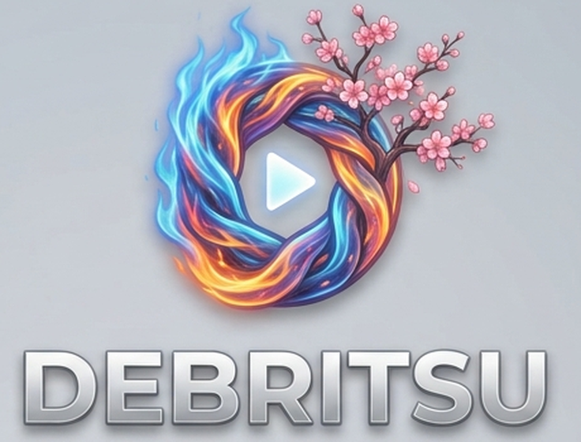

<div align="center">



**An AniList anime client that streams from your debrid account — no scraping, no dead sources.**

[](../../releases)
[](../../releases)
[](LICENSE)


</div>

---

## Why Debritsu

Most anime apps scrape streaming sites. Sources break weekly, quality is a lottery, and half the extensions are dead by the time you install them.

Debritsu doesn't scrape anything. It talks to **Stremio addons** — the same ones you might already run with AIOStreams, Comet or MediaFusion — and plays the cached, direct link your **debrid provider** hands back. Your library lives on AniList, so your progress follows you everywhere.

If you already have a debrid subscription and a configured addon, this is the client that gets out of the way.

---

## Features

**Stremio addon support** — Add as many addon URLs as you like. Debritsu queries them all in parallel and merges the results into one source list.

**Four debrid services** — Real-Debrid, AllDebrid, Premiumize and TorBox. Most addons return a ready link so nothing extra is needed, but bare infoHashes get resolved through your provider automatically.

**Full AniList integration** — Sign in with one tap. Browse Trending, search, and see Continue watching and Plan to watch as side-scrolling shelves. Change list status, progress and score from inside the app. Progress pushes itself at 85% of an episode.

**Genuinely offline downloads** — Download an episode and it plays with **no connection at all**. Titles, posters and episode numbers are cached at download time, so the library isn't a blank screen when you're on a plane. Anything watched offline is queued and syncs the moment you're back online.

**Filler and recap flags** — Episodes are marked FILLER or RECAP from MyAnimeList data, so you know what's safe to skip before you start.

**Switch source mid-episode** — Discovered it's a dub three minutes in? Tap Sources in the player, pick another, and it resumes at the same second.

**Proper subtitle control** — Embedded tracks, addon-supplied tracks and Stremio subtitle addons all appear under one CC button. Size, colour, background and outline are yours to set, and embedded styling is overridden so your choices stick.

**Resume where you stopped** — Per-episode positions saved locally, with a progress bar on every episode chip. Nothing under 15 seconds is saved, and nothing past 92% offers to resume you into the credits.

**Know before you watch** — Average score, popularity rank, favourites, studio, genres, season, format and runtime on every show, plus a Related row for prequels, sequels and side stories.

**Made to look like something** — Night-violet theme throughout, with technical detail set in monospace so the source list reads like the torrent metadata it actually is.

---

## Install

Download the APK from [**Releases**](../../releases) and open it on your phone. Android will ask you to allow installs from whichever app you downloaded it with.

For automatic updates, add this repository to [**Obtainium**](https://github.com/ImranR98/Obtainium).

Requires Android 8.0 or newer.

---

## Setup

**1. Add an addon.** Settings → Stremio addons → paste your addon URL. A debrid-backed addon such as AIOStreams, Comet, MediaFusion or Torrentio configured with your debrid key is what you want — those return cached direct links. Both `manifest.json` URLs and `stremio://` links work.

**2. Sign in to AniList.** Settings → AniList → Sign in. Optional; browsing and playback work without an account, but you lose progress tracking and your lists.

**3. Add a debrid key.** Only needed if your addon returns bare infoHashes rather than links. If your addon already holds your debrid key, leave this blank.

That's it. Open a show, tap Play, pick a source.

---

## Building it yourself

Requires JDK 17 and the Android SDK.

```
gradle assembleDebug
```

The APK lands in `app/build/outputs/apk/debug/`. For one-tap AniList sign-in in your own builds, register a client at [anilist.co/settings/developer](https://anilist.co/settings/developer) with redirect URL `debritsu://auth`, then put the numeric ID in `anilist.properties`:

```
clientId=12345
```

Releases are cut by publishing a tagged release on GitHub, which builds and attaches a signed APK automatically.

---

## Known limits

- Very new shows sometimes aren't in the community mapping tables yet, so sources may not be found for a week or two after airing.
- Episode numbering follows AniList, which can disagree with Kitsu on long-running shows — the usual absolute-versus-seasonal mismatch.
- Downloads resolve links when you start them, and debrid URLs expire, so a download paused for hours may need restarting.
- AniList tokens last a year and can't be refreshed, so you'll sign in again annually.

---

## Disclaimer

Debritsu ships **no sources, no scrapers and no content**. It is a client for Stremio addons and debrid accounts that you configure and are responsible for. Nothing is hosted, indexed or provided by this project.

Please don't upload this app, or any fork of it, to Google Play or other app stores.

---

<div align="center">

Built with Kotlin, Jetpack Compose and Media3.

</div>
